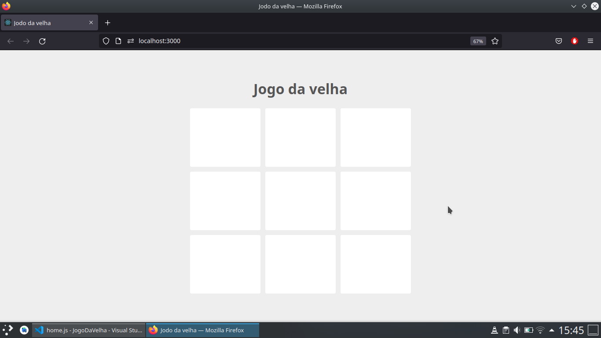
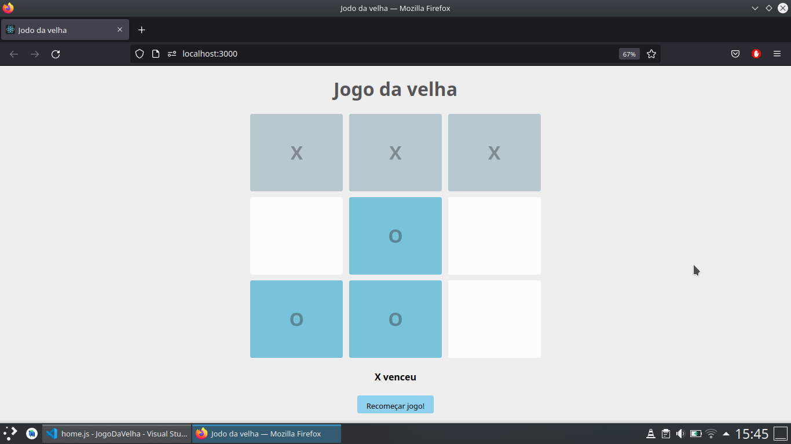

# Jogo da Velha

## 💻 Projeto
Clone do jogo da velha, que dois participantes, cada um com um tipo de peça ou símbolo, alternam as jogadas e têm como objetivo formar uma linha reta com suas peças, seja ela vertical, horizontal ou diagonal. Aquele que a fizer primeiro vence, ou seja, também é importante impedir que o oponente a faça antes.

## 🌐 Preview

 
    
Tela de Home 

    
    

 

## 🚀 Tecnologias

Esse projeto foi desenvolvido com as seguintes tecnologias:

- ReactJs
- JavaScript
